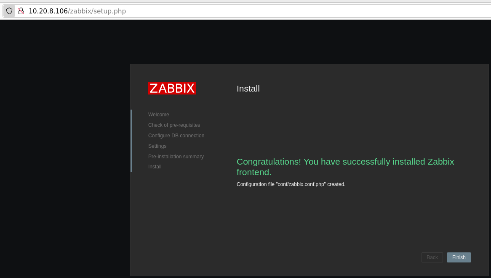
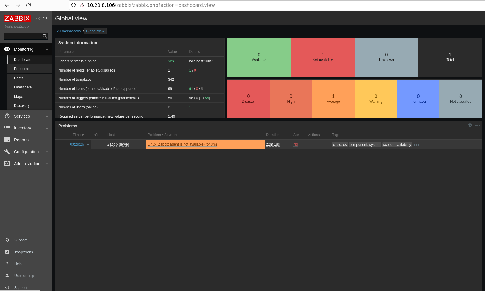

# Домашнее задание к занятию «Система мониторинга Zabbix»

В практике есть 2 основных и 1 дополнительное (со звездочкой) задания. Первые два нужно выполнять обязательно, третье - по желанию и его решение никак не повлияет на получение вами зачета по этому домашнему заданию, при этом вы сможете глубже и/или шире разобраться в материале. 

Пожалуйста, присылайте на проверку всю задачу сразу. Любые вопросы по решению задач задавайте в чате учебной группы.

### Цели задания
1. Научиться устанавливать Zabbix Server c веб-интерфейсом
2. Научиться устанавливать Zabbix Agent на хосты
3. Научиться устанавливать Zabbix Agent на компьютер и подключать его к серверу Zabbix 

### Чеклист готовности к домашнему заданию
- [ ] Просмотрите в личном кабинете занятие "Система мониторинга Zabbix" 

---

### Задание 1 

Установите Zabbix Server с веб-интерфейсом.

#### Процесс выполнения
1. Выполняя ДЗ, сверяйтесь с процессом отражённым в записи лекции.
2. Установите PostgreSQL. Для установки достаточна та версия, что есть в системном репозитороии Debian 11.

`apt update`


`apt install postgresql`


3. Пользуясь конфигуратором команд с официального сайта, составьте набор команд для установки последней версии Zabbix с поддержкой PostgreSQL и Apache.

[Конфигуратор с официального сайта Zabbix](https://www.zabbix.com/ru/download?zabbix=6.0&os_distribution=debian&os_version=11&components=server_frontend_agent&db=pgsql&ws=apache). Выполняем последовательно команды.

`wget https://repo.zabbix.com/zabbix/6.0/debian/pool/main/z/zabbix-release/zabbix-release_6.0-4+debian11_all.deb`


Устанавливаем пакет с репозиторем Zabbix

`dpkg -i zabbix-release_6.0-4+debian11_all.deb`


`ls -la /etc/apt/sources.list.d`


`apt update`


4. Выполните все необходимые команды для установки Zabbix Server и Zabbix Web Server.

Устанавливаем Zabbix сервер, веб-интерфейс

`apt install zabbix-server-pgsql zabbix-frontend-php php7.4-pgsql zabbix-apache-conf zabbix-sql-scripts`


`systemctl status zabbix-server.service`


> Создаем пользователя

Команда из консоли `sudo -u postgres createuser --pwprompt zabbix`

Команда из bash скрипта

`su - postgres -c 'psql --command "CREATE USER zabbix WITH PASSWORD '\'123456789\'';"'`


> Создаем базу данных

Команда из консоли `sudo -u postgres createdb -O zabbix zabbix`

Команда из# bash скрипта

`su - postgres -c 'psql --command "CREATE DATABASE zabbix OWNER zabbix;"'`


> Импортируем начальную схему и данные. 

`zcat /usr/share/zabbix-sql-scripts/postgresql/server.sql.gz | sudo -u zabbix psql zabbix`


> Редактируем файл /etc/zabbix/zabbix_server.conf

Для проверки выполняем поиск фала конфигурации Zabbix сервер `find / -name zabbix_server.conf`


`nano /etc/zabbix/zabbix_server.conf`

Ctrl+W ищем фразу DBPassword и изменяем параметр `DBPassword=1234546789` на созданный раннее пароль. Сохраняем Clrt+O и закрываем Ctrl+X файл конфигурации


Либо изменяем параметр `DBPassword` следующей bash командой

`sed -i 's/# DBPassword=/DBPassword=123456789/g' /etc/zabbix/zabbix_server.conf`

> Запускаем процессы Zabbix сервера и настраиваем их запуск при загрузке ОС

```
systemctl restart zabbix-server apache2
systemctl enable zabbix-server apache2
```


> Проверка запуска Zabbix сервера

`systemctl status zabbix-server`


> WEB интерфейс Zabbix





#### Требования к результаты 
1. Прикрепите в файл README.md скриншот авторизации в админке.
2. Приложите в файл README.md текст использованных команд в GitHub.

---

### Задание 2 

Установите Zabbix Agent на два хоста.

> Установку производим на 2 отдельных сервера по [сценарию с сайта Zabbix](https://www.zabbix.com/ru/download?zabbix=6.0&os_distribution=debian&os_version=11&components=agent&db=&ws=). В столбце Компонент Забикс выбираем только Агент.

#### Процесс выполнения
1. Выполняя ДЗ, сверяйтесь с процессом отражённым в записи лекции.
2. Установите Zabbix Agent на 2 вирт.машины, одной из них может быть ваш Zabbix Server.


> Установите репозиторий Zabbix

```
wget https://repo.zabbix.com/zabbix/6.0/debian/pool/main/z/zabbix-release/zabbix-release_6.0-4+debian11_all.deb
dpkg -i zabbix-release_6.0-4+debian11_all.deb
apt update
```


> Установка Zabbix агента

`apt install zabbix-agent`


`systemctl status zabbix-agent.service`


> Запускаем процесс Zabbix агента настраиваем его запуск при загрузке ОС.

```
systemctl restart zabbix-agent
systemctl enable zabbix-agent
```


3. Добавьте Zabbix Server в список разрешенных серверов ваших Zabbix Agentов.

> Осуществляем поиск конфигурационного файла Zabbix агента

`find / -name zabbix_agentd.conf`


> Находим попытки несанкционированного подключения сервера к агенту

```
root@srv2:~# find / -name zabbix_agentd.log
/var/log/zabbix/zabbix_agentd.log
root@srv2:~# tail -f /var/log/zabbix/zabbix_agentd.log
```


> Производим замену IP адреса сервера bash командой или через редактор `nano /etc/zabbix/zabbix_agentd.conf` 

`sed -i 's/Server=127.0.0.1/Server=10.20.8.106/g' /etc/zabbix/zabbix_agentd.conf`

`cat /etc/zabbix/zabbix_agentd.conf | grep Server=`


4. Добавьте Zabbix Agentов в раздел Configuration > Hosts вашего Zabbix Servera.
5. Проверьте, что в разделе Latest Data начали появляться данные с добавленных агентов.

#### Требования к результаты 
1. Приложите в файл README.md скриншот раздела Configuration > Hosts, где видно, что агенты подключены к серверу
2. Приложите в файл README.md скриншот лога zabbix agent, где видно, что он работает с сервером
3. Приложите в файл README.md скриншот раздела Monitoring > Latest data для обоих хостов, где видны поступающие от агентов данные.
4. Приложите в файл README.md текст использованных команд в GitHub

---
## Задание 3 со звёздочкой*
Установите Zabbix Agent на Windows (компьютер) и подключите его к серверу Zabbix.

#### Требования к результаты 
1. Приложите в файл README.md скриншот раздела Latest Data, где видно свободное место на диске C:
--- 

## Критерии оценки

1. Выполнено минимум 2 обязательных задания
2. Прикреплены требуемые скриншоты и тексты 
3. Задание оформлено в шаблоне с решением и опубликовано на GitHub


