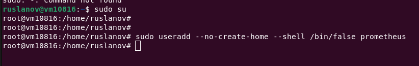

# Домашнее задание к занятию «Система мониторинга Prometheus»

Это задание для самостоятельной отработки навыков и не предполагает обратной связи от преподавателя. Его выполнение не влияет на завершение модуля. Но мы рекомендуем его выполнить, чтобы закрепить полученные знания.

### Цели задания

1. Научиться устанавливать Prometheus
2. Научиться устанавливать Node Exporter
3. Научиться подключать Node Exporter к серверу Prometheus
4. Научиться устанавливать Grafana и интегрировать с Prometheus


### Чеклист готовности к домашнему заданию
- [ ] Просмотрите в личном кабинете занятие "Система мониторинга Prometheus" 

### Задание 1*
Установите Prometheus.

#### Прetcоцесс выполнения
1. Выполняя задание, сверяйтесь с процессом, отражённым в записи лекции
2. Создайте пользователя prometheus

> Создаем пользователя 

`sudo useradd --no-create-home --shell /bin/false prometheus`



3. Скачайте prometheus и в соответствии с лекцией разместите файлы в целевые директории

> Скачиваем последний дистрибутив с [GiHub](https://github.com/prometheus/prometheus/releases)

`wget https://github.com/prometheus/prometheus/releases/download/v2.47.1/prometheus-2.47.1.linux-amd64.tar.gz`


> Извлечем его из архива и перейдем в созданную папку

```
tar xvfz prometheus-2.47.1.linux-amd64.tar.gz
cd ./prometheus-2.47.1.linux-amd64
```


4. Создайте сервис как показано на уроке

> Переносим утилиты Prometheus в свои директории и передадим права только что созданному пользователю prometheus

```
mkdir /etc/prometheus
mkdir /var/lib/prometheus
```

> Копируем утилиты prometheus и promtool в директорию /usr/local/bin

`cp ./prometheus promtool /usr/local/bin`

> Копируем папку console_libraries и consoles в директорию /etc/prometheus

```
cp -R ./console_libraries/ /etc/prometheus
cp -R ./consoles/ /etc/prometheus
```

> Копируем конфиг файл prometheus.yml в папку /etc/prometheus

`cp ./prometheus.yml /etc/prometheus`

> Проверяем начилие всех фалов в каталоге /etc/prometheus

`ls -l /etc/prometheus/`


> Передаем права пользователю prometheus

```
chown -R prometheus:prometheus /etc/prometheus /var/lib/prometheus
chown prometheus:prometheus /usr/local/bin/prometheus
chown prometheus:prometheus /usr/local/bin/promtool
```


> Проверяем правильно ли мы разместили все файлы.

`/usr/local/bin/prometheus --config.file /etc/prometheus/prometheus.yml --storage.tsdb.path /var/lib/prometheus/ --web.console.templates=/etc/prometheus/consoles --web.console.libraries=/etc/prometheus/console_libraries`

Сообщение: msg="Server is ready to receive web requests." говорит о том, что все запустилось и ожидает входящие запросы


> Добро пожаловать в **Prometheus**


> Создание сервиса для работы с Prometheus

`nano /etc/systemd/system/prometheus.service`

> Вставляем в файл сервиса **prometheus.service** следующее содержимое

```
[Unit]
Description=Prometheus Service Netology Lesson 9.4
After=network.target
[Service]
User=prometheus
Group=prometheus
Type=simple
ExecStart=/usr/local/bin/prometheus \
--config.file /etc/prometheus/prometheus.yml \
--storage.tsdb.path /var/lib/prometheus/ \
--web.console.templates=/etc/prometheus/consoles \
--web.console.libraries=/etc/prometheus/console_libraries
ExecReload=/bin/kill -HUP $MAINPID Restart=on-failure
[Install]
WantedBy=multi-user.target
```


> Передаем права на файл пользователю **prometheus**

`chown -R prometheus:prometheus /var/lib/prometheus`

> Пропиcываем автозапуск сервиса **prometheus**

`sudo systemctl enable prometheus`

> Запускаем сервис

`sudo systemctl start prometheus`

> Проверяем статус сервиса

`sudo systemctl status prometheus`

5. Проверьте что prometheus запускается, останавливается, перезапускается и отображает статус с помощью systemctl


Снова проверяем доступность Web интерфейса


#### Требования к результату
- [ ] Прикрепите к файлу README.md скриншот systemctl status prometheus, где будет написано: prometheus.service — Prometheus Service Netology Lesson 9.4 — [Ваши ФИО]

---

### Задание 2*
Установите Node Exporter.

#### Процесс выполнения
1. Выполняя ДЗ сверяйтесь с процессом отражённым в записи лекции.
3. Скачайте node exporter приведённый в презентации и в соответствии с лекцией разместите файлы в целевые директории

> Скачивам архив с [Node Exporter](https://github.com/prometheus/node_exporter/releases/) и извлекае его

```
wget https://github.com/prometheus/node_exporter/releases/download/v1.6.1/node_exporter-1.6.1.linux-amd64.tar.gz
tar xvfz node_exporter-1.6.1.linux-amd64.tar.gz
```


> Переходим в папку и запускаем **node_exporter**

```
cd node_exporter-1.6.1.linux-amd64
./node_exporter
```

> Проверяем работоспособность по адресу http://<ip_сервера>:9100/metrics


4. Создайте сервис для как показано на уроке

> Копируем Node Exporter в папку Prometheus

```
mkdir /etc/prometheus/node-exporter
cp ./* /etc/prometheus/node-exporter
```

> Передаем права на папку пользователю Prometheus

```
chown -R prometheus:prometheus /etc/prometheus/node-exporter/
chown -R prometheus:prometheus /etc/prometheus/node-exporter/node_exporter
ls -l /etc/prometheus/node-exporter/
```


> Создаем сервис для работы с Node Exporter

`nano /etc/systemd/system/node-exporter.service`

> Вставляем в файл сервиса содержимое

```
[Unit]
Description=Node Exporter Lesson 9.4
After=network.target
[Service]
User=prometheus
Group=prometheus
Type=simple
ExecStart=/etc/prometheus/node-exporter/node_exporter
[Install]
WantedBy=multi-user.target
```


> Прописываем автозапуск

`sudo systemctl enable node-exporter`

> Запускаем сервис

`sudo systemctl start node-exporter`

> Проверяем статус сервиса

`sudo systemctl status node-exporter`

5. Проверьте что node exporter запускается, останавливается, перезапускается и отображает статус с помощью systemctl


#### Требования к результату
- [ ] Прикрепите к файлу README.md скриншот systemctl status node-exporter, где будет написано: node-exporter.service — Node Exporter Netology Lesson 9.4 — [Ваши ФИО]

---

### Задание 3*
Подключите Node Exporter к серверу Prometheus.

#### Процесс выполнения
1. Выполняя ДЗ сверяйтесь с процессом отражённым в записи лекции.
2. Отредактируйте prometheus.yaml, добавив в массив таргетов установленный в задании 2 node exporter

> Редактируем файл конфигурацию Prometheus

`nano /etc/prometheus/prometheus.yml`

> Добавляем в scrape_config адрес экспортёра

```
scrape_configs:
— job_name: 'prometheus'
scrape_interval: 5s
static_configs:
— targets: ['localhost:9090', 'localhost:9100']
```


3. Перезапустите prometheus

> Перезапускаем Prometheus

`systemctl restart prometheus`

4. Проверьте что он запустился


#### Требования к результату
- [ ] Прикрепите к файлу README.md скриншот конфигурации из интерфейса Prometheus вкладки Status > Configuration


- [ ] Прикрепите к файлу README.md скриншот из интерфейса Prometheus вкладки Status > Targets, чтобы было видно минимум два эндпоинта


---
## Дополнительные задания со звёздочкой*
Эти задания дополнительные. Их можно не выполнять. Это не повлияет на зачёт. Вы можете их выполнить, если хотите глубже разобраться в материале.

---

### Задание 4*
Установите Grafana.

#### Требования к результату
- [ ] Прикрепите к файлу README.md скриншот левого нижнего угла интерфейса, чтобы при наведении на иконку пользователя были видны ваши ФИО

---

### Задание 5*
Интегрируйте Grafana и Prometheus.

#### Требования к результату
- [ ] Прикрепите к файлу README.md скриншот дашборда (ID:11074) с поступающими туда данными из Node Exporter

## Критерии оценки
1. Выполнено минимум 3 обязательных задания
2. Прикреплены требуемые скриншоты
3. Задание оформлено в шаблоне с решением и опубликовано на GitHub


